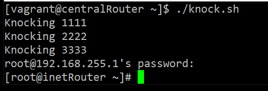
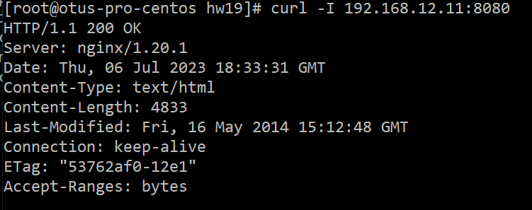

## OTUS Administrator Linux. Professional ДЗ №19: Фильтрация трафика - iptables

**Задание**

1. реализовать knocking port
2. centralRouter может попасть на ssh inetrRouter через knock скрипт (пример: https://wiki.archlinux.org/title/Port_knocking)
3. добавить inetRouter2, который виден(маршрутизируется (host-only тип сети для виртуалки)) с хоста или форвардится порт через локалхост.
4. запустить nginx на centralServer.
5. пробросить 80й порт на inetRouter2 8080.
6. дефолт в инет оставить через inetRouter.
7. (\*) реализовать проход на 80й порт без маскарадинга

Формат сдачи ДЗ - vagrant + ansible

**_Решение_**

Решено при помощи vagrant.
Port-knocking реализован при помощи iptables. Последовательность - 1111->2222->3333.

Скриншот-подтверждение:

Порт 80 проброшен на inetRouter2 (192.168.12.11) при помощи snat/dnat порт 8080.

Скриншот-подтверждение:

Маршрут с centralRouter в интернет - без изменений, через inetRouter
